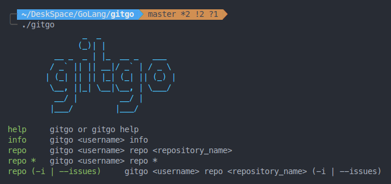
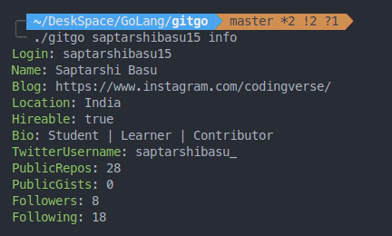
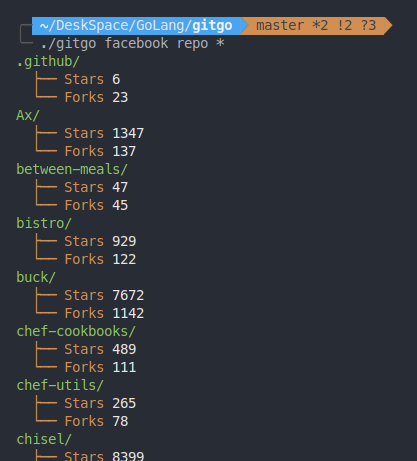
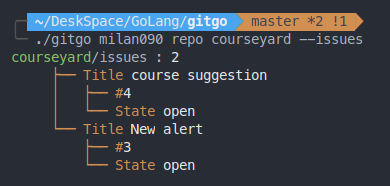

```
        _  _
       (_)| |
  __ _  _ | |_  __ _   ___
 / _` || || __|/ _` | / _ \
| (_| || || |_| (_| || (_) |
 \__, ||_| \__|\__, | \___/
  __/ |         __/ |
 |___/         |___/
```

# gitgo

A simple GitHub API integration with GoLang

## Installation

- ### Prequisites

  - Go ~= go1.15.6

```sh
$ curl https://raw.githubusercontent.com/saptarshibasu15/gitgo/master/install.sh | sh
```

## Usage

Add it to your PATH for a session

```sh
export PATH=$PATH:~/go/bin/
```

Or add it to your `~/.zshrc`, etc. for permanent use

- #### Help :

`gitgo` or `gitgo help`



- #### User Info :

```sh
gitgo <username> info
```



- #### Repositories

  - `repo`


  ```sh
  gitgo <username> repo <repository_name>
  ```

  

  - `repo *`


  ```sh
  gitgo <username> repo *
  ```

  

  - `repo (-i | --issues)`
  

  ```sh
  gitgo <username> repo <repository_name> (-i | --issues)
  ```

  


## Contributions

Any contribution is welcome! Feel free to fix our code or a typo!
