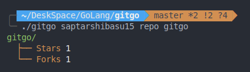

```
        _  _
       (_)| |
  __ _  _ | |_  __ _   ___
 / _` || || __|/ _` | / _ \
| (_| || || |_| (_| || (_) |
 \__, ||_| \__|\__, | \___/
  __/ |         __/ |
 |___/         |___/
```

# gitgo

A simple GitHub API integration with GoLang

## Installation

- ### Prequisites

  - Go ~= go1.15.6

  run this command to check your go version `go version`

```bash
$ go get github.com/saptarshibasu15/gitgo
$ go install github.com/saptarshibasu15/gitgo
```

## Usage

```bash
$ cd ~/go/bin/
```

- #### help :

`$ ./gitgo` or `$ ./gitgo help`


- #### user info :

```bash
$ ./gitgo <username> info
```


- #### repositories

  - repo

  ```bash
  $ ./gitgo <username> repo <repository_name>
  ```

  

  - repo \*

  ```bash
  $ ./gitgo <username> repo *
  ```

  

  - repo (-i | --issues)

  ```bash
  $ ./gitgo <username> repo <repository_name> (-i | --issues)
  ```

  
